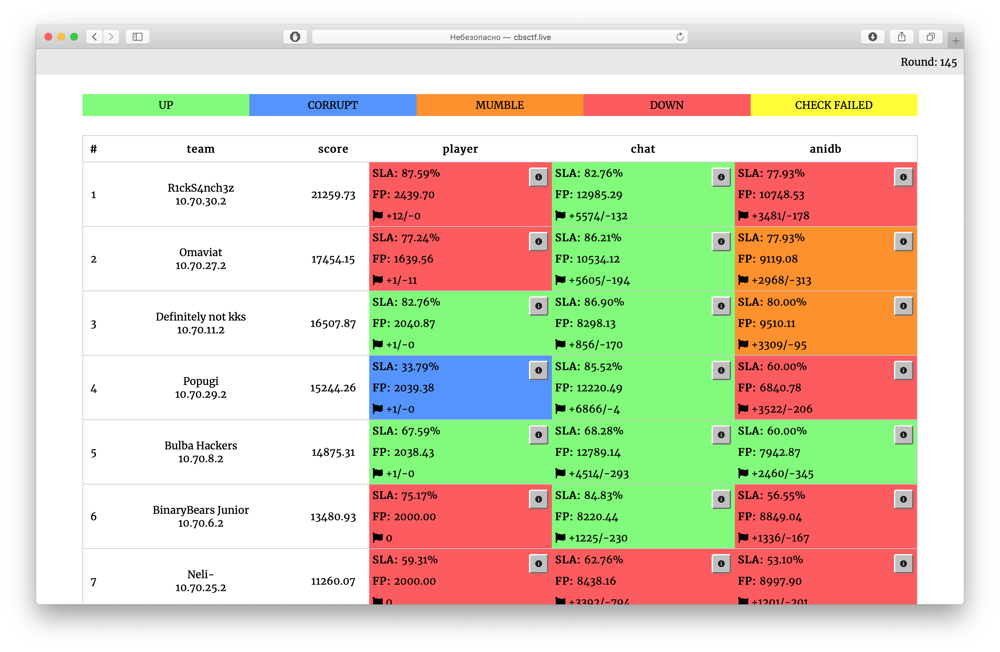

# Attack-Defence тренировка от C4T BuT S4D

Исходные коды сервисов, чекеры и сплоиты с тренировки 17 ноября 2019.

## Результаты

[Полный финальный скорборд](scoreboard/full.png)

## Сервисы

| Сервис | Язык | Чекер | Сплоиты | Автор |
|--------|------|-------|---------|-------|
| **[player](services/anilist/src/player/)** | Python, C | [Чекер](checkers/anilist/player/) | [Сплоиты](sploits/anilist/player/) | [@pomo_mondreganto](https://github.com/pomo-mondreganto) |
| **[chat](services/anilist/src/chat/)** | NodeJS | [Чекер](checkers/anilist/chat/) | [Сплоиты](sploits/anilist/chat/) | [@kekov](https://github.com/xmikasax) |
| **[anidb](services/anilist/src/anidb/)** | Python | [Чекер](checkers/anilist/anidb/) | [Сплоиты](sploits/anilist/anidb/) | [@jnovikov](https://github.com/jnovikov) |

## Образ

- Ubuntu 18.04.1 LTS
- Alpine in Docker

## Инфраструктура

- DevOps: author [@pomo-mondreganto](https://github.com/pomo-mondreganto)
- Проверяющая система: [ForcAD](https://github.com/pomo-mondreganto/ForcAD)

## Разбор
Приближается...
